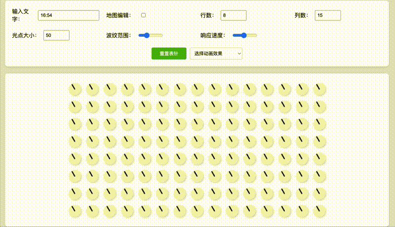
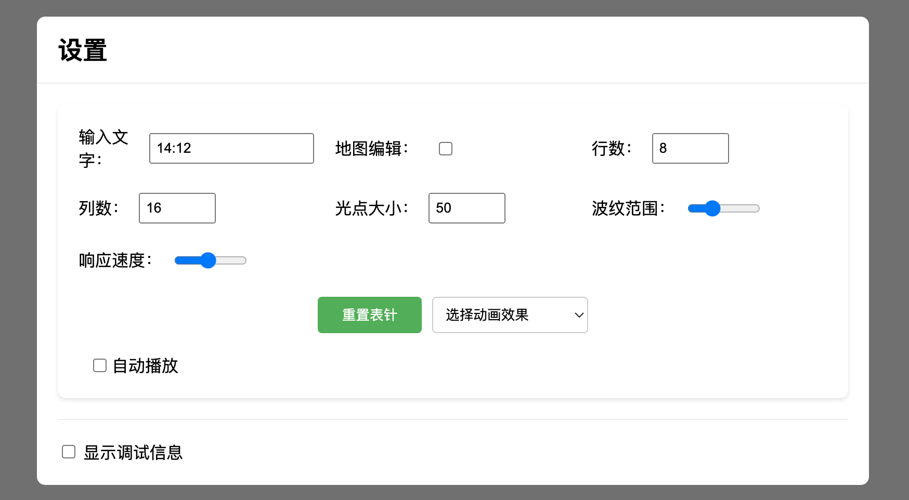
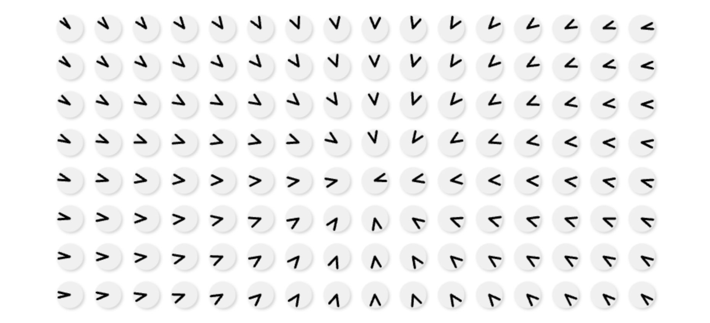
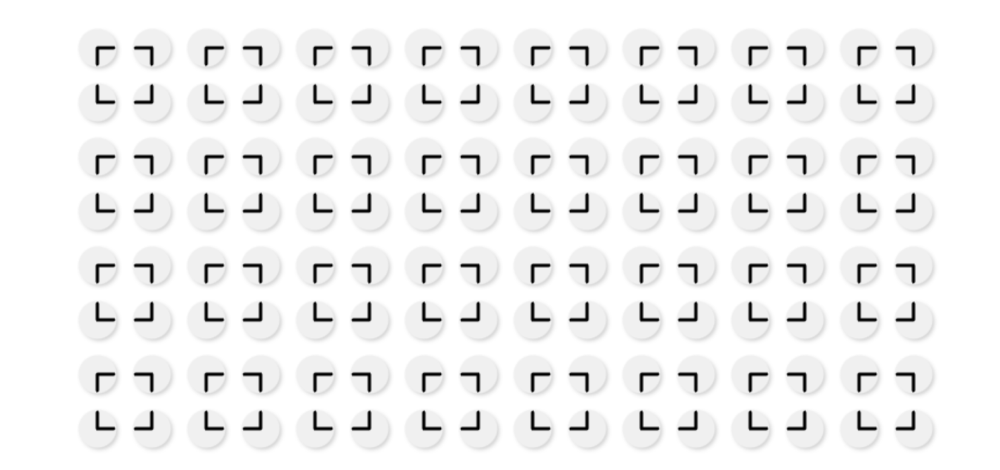

# Light Matrix Display - An interactive web application that simulates a matrix of light needles

# AIclock - Light Matrix Display / 光线矩阵显示器 / ライトマトリックスディスプレイ

[English](#english) | [中文](#中文) | [日本語](#日本語)

### Online Demo / 在线体验 / オンラインデモ
👉 [Try it now](https://res.xrunda.com/aiclock/index.html) / [立即体验](https://res.xrunda.com/aiclock/index.html) / [今すぐ試す](https://res.xrunda.com/aiclock/index.html)



## English

### Introduction
AIclock is an interactive web application that simulates a matrix of light needles, capable of displaying time, text, and animations. Each light point consists of two needles that can rotate independently to create various visual effects.

### Demo Video
<div align="center">
  <a href="example/shuai.mp4" target="_blank">
    
  </a>
  <p>👆 Click to watch demo video</p>
</div>

### Features
- Real-time clock display
- Text display support
- Custom animations
- Interactive editing mode
- Auto-play functionality
- Configurable display parameters
- Debug information panel

### Screenshots
<div align="center">



</div>

### Project Structure
```
aiclock/
├── index.html              # Main HTML file
├── styles.css             # Styles
├── js/
│   ├── main.js           # Main Vue application
│   ├── LightMatrix.js    # Light matrix rendering
│   └── animations.js     # Animation definitions
├── font_configs/         # Font configuration files
│   ├── number_config.json
│   └── style_config.json
└── python/              # Font processing tools
    ├── font_code.py
    └── matrix_control.py
```

### Technical Details
- Frontend: Vue.js 3
- Canvas-based rendering
- JSON-based font configuration
- Python tools for font processing

### Online Demo
Try the live demo at: [https://res.xrunda.com/aiclock/index.html](https://res.xrunda.com/aiclock/index.html)

### Quick Start
1. Clone the repository
```bash
git clone https://github.com/yourusername/aiclock.git
```

2. Set up the development environment
```bash
# For font processing tools (optional)
pip install freetype-py numpy
```

3. Deploy the static files to your web server or run locally

### Usage
- The display automatically shows current time
- Click on any light point in edit mode to adjust needle positions
- Configure display parameters through the settings panel
- Create custom animations using the animation API

### License
This project is licensed under the MIT License - see the [LICENSE](LICENSE) file for details.
Commercial use is permitted.

### Author
- Guang Li (guangli@xrunda.com)

---

## 中文

### 简介
AIclock 是一个交互式网页应用，模拟了一个由光针组成的矩阵，能够显示时间、文字和动画效果。每个光点由两个可以独立旋转的指针组成，用于创造各种视觉效果。

### 演示视频
<div align="center">
  <a href="example/shuai.mp4" target="_blank">
    
  </a>
  <p>👆 点击观看演示视频</p>
</div>

### 功能特点
- 实时时钟显示
- 文字显示支持
- 自定义动画
- 交互式编辑模式
- 自动播放功能
- 可配置显示参数
- 调试信息面板

### 项目结构
```
aiclock/
├── index.html              # 主 HTML 文件
├── styles.css             # 样式表
├── js/
│   ├── main.js           # Vue 主应用
│   ├── LightMatrix.js    # 光矩阵渲染
│   └── animations.js     # 动画定义
├── font_configs/         # 字体配置文件
│   ├── number_config.json
│   └── style_config.json
└── python/              # 字体处理工具
    ├── font_code.py
    └── matrix_control.py
```

### 技术细节
- 前端：Vue.js 3
- Canvas 渲染
- 基于 JSON 的字体配置
- Python 字体处理工具

### 在线体验
访问在线演示：[https://res.xrunda.com/aiclock/index.html](https://res.xrunda.com/aiclock/index.html)

### 快速开始
1. 克隆仓库
```bash
git clone https://github.com/yourusername/aiclock.git
```

2. 配置开发环境
```bash
# 安装字体处理工具（可选）
pip install freetype-py numpy
```

3. 部署静态文件到网页服务器或本地运行

### 使用说明
- 显示器自动显示当前时间
- 在编辑模式下点击任意光点调整指针位置
- 通过设置面板配置显示参数
- 使用动画 API 创建自定义动画

### 许可证
本项目采用 MIT 许可证 - 详见 [LICENSE](LICENSE) 文件。
允许商业使用。

### 作者
- 李光 (guangli@xrunda.com)

---

## 日本語

### はじめに
AIclockは、光の針で構成されたマトリックスをシミュレートするインタラクティブなウェブアプリケーションです。時間、テキスト、アニメーションを表示することができ、各光点は独立して回転する2本の針で構成されています。

### デモビデオ
<div align="center">
  <a href="example/shuai.mp4" target="_blank">
    
  </a>
  <p>👆 クリックしてデモビデオを見る</p>
</div>

### 特徴
- リアルタイム時計表示
- テキスト表示対応
- カスタムアニメーション
- インタラクティブ編集モード
- 自動再生機能
- 設定可能なディスプレイパラメータ
- デバッグ情報パネル

### プロジェクト構造
```
aiclock/
├── index.html              # メインHTMLファイル
├── styles.css             # スタイル
├── js/
│   ├── main.js           # Vue メインアプリケーション
│   ├── LightMatrix.js    # ライトマトリックス描画
│   └── animations.js     # アニメーション定義
├── font_configs/         # フォント設定ファイル
│   ├── number_config.json
│   └── style_config.json
└── python/              # フォント処理ツール
    ├── font_code.py
    └── matrix_control.py
```

### 技術詳細
- フロントエンド：Vue.js 3
- Canvas ベースの描画
- JSON ベースのフォント設定
- Python フォント処理ツール

### オンラインデモ
ライブデモはこちら：[https://res.xrunda.com/aiclock/index.html](https://res.xrunda.com/aiclock/index.html)

### クイックスタート
1. リポジトリをクローン
```bash
git clone https://github.com/yourusername/aiclock.git
```

2. 開発環境のセットアップ
```bash
# フォント処理ツールのインストール（オプション）
pip install freetype-py numpy
```

3. 静的ファイルをウェブサーバーにデプロイまたはローカルで実行

### 使用方法
- ディスプレイは自動的に現在時刻を表示
- 編集モードで任意の光点をクリックして針の位置を調整
- 設定パネルでディスプレイパラメータを設定
- アニメーション API を使用してカスタムアニメーションを作成

### ライセンス
このプロジェクトは MIT ライセンスの下で提供されています - 詳細は [LICENSE](LICENSE) ファイルをご覧ください。
商用利用が可能です。

### 作者
- 李光 (guangli@xrunda.com)

---

## Contributing
Contributions are welcome! Please feel free to submit a Pull Request.

## Project Status
Active development - This project is being actively developed and maintained.

---

## Support the Project / 支持项目 / プロジェクトをサポート

If you find this project helpful, consider buying me a coffee ☕

如果这个项目对您有帮助，可以请作者喝杯咖啡 ☕

このプロジェクトが役に立つと思ったら、コーヒーをおごってください ☕

<div align="center">
  
  <p>Thank you for your support! / 感谢您的支持！/ ご支援ありがとうございます！</p>
</div>
